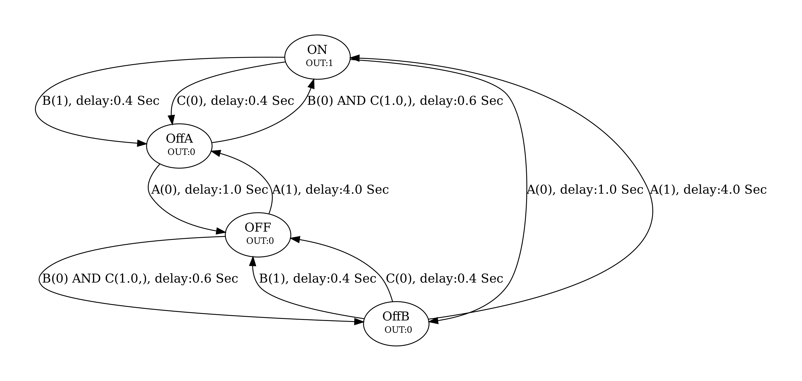

# ModelBasedTester-AllPaths

This program is used for generating test cases.  I use it to test the software (and hardware) on Power Supplies, Motor Controllers, and Batteries.  It should generally be useful for almost any embedded controller and beyond.

Steps:
1.) Create a model of how the system should work by using a combination of state machine diagrams, and definitions in python.
2.) Import the model.
3.) Generate a simplified Moore state machine model from the system model.
4.) Create a sequence that will go through every transition at least once in the moore state machine model.
5.) Convert this secquence into a test that includes action, and expected results after each test.

The power of this kind of test case generation is that it tests many more code paths than a human and other automated testers I've used will test.

Installation:
1.) clone the repo
2.) Browse to the repo directory
3.) sudo python -m pip install .
4.) install graphviz from their website.

Usage:

Open a python command line in a folder you'd like to work out of.
Then load the package using this code.

```python
# load package
from MBT.MBT import MBT
MBT=MBT()
```
Then create a new project.  

```python
# Create a new Project
MBT.new("HelloWorld")
```

The new project will contain an example state machine model that can be viewed and edited using.
```python
# View and edit the state machine model of the system.
MBT.edit()
```
The new project also contains an example InputOutputs.py file that can be changed and edited to model the system.
This file adds dependent inputs and outputs that can be used to model things that aren't easy to model in a state machine or are cumbersome.
Good examples are status bits that depend upon severl other variables defined within the state machine.
Another example would be a general clear status bit command.


Once the state machine and InputOutputs.py file are filed out and model the system, the next step is to load them.

```python
# View and edit the state machine model of the system.
MBT.load()
```
The state machine model can exported to pdf using
```python
# View and edit the state machine model of the system.  graphviz must be installed for this work because the program uses dot from graphviz.
MBT.show()
```

Next the model can be converted to a Moore state machine.
```python
# Convert model to a Moore state machine
MBT.exploreModel()
```
The large Moore model can exported to pdf using
```python
# Convert model to a Moore state machine
MBT.showE()
```
The Moore state machine is much more complex looking than the input model because the input model is condensed modeling that incudes things like Mealy state machine, and inputoutput file that adds extra functionality to the model.


Finally, a test can be written from the explored model that will test every state transition.
```python
# Convert model to a Moore state machine
MBT.createTests()
```

This test can be run on actual hardware using the testing program in my other repository.
